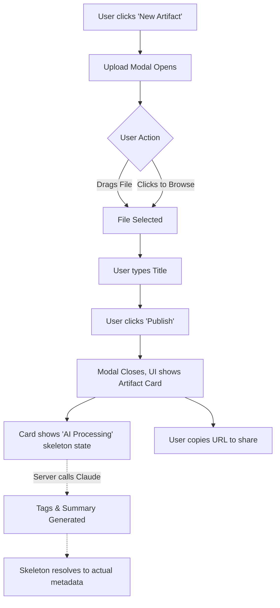
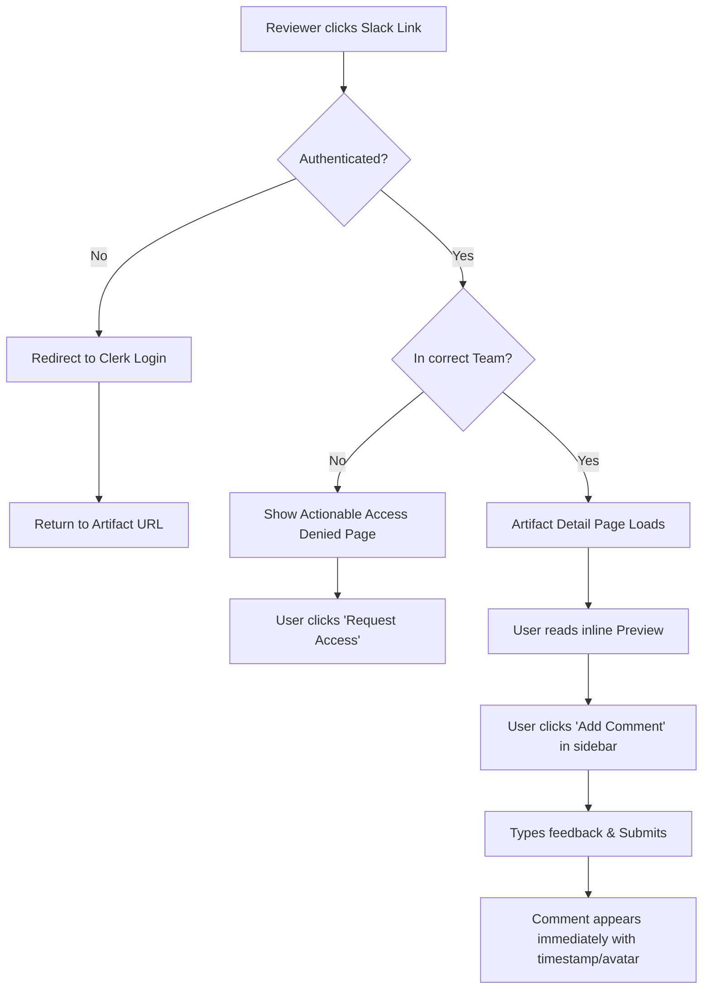

# UX Design Specification Yurii_Krot@epam.com-Artifact-Hub

**Author:** Yurii
**Date:** 2026-04-14

---

<!-- UX design content will be appended sequentially through collaborative workflow steps -->

## Executive Summary

### Project Vision

Artifact Hub is meant to be the stable layer beneath all AI tools, providing a persistent, browsable, team-visible catalog for publishing, reviewing, and discovering AI-generated content. It aims to solve the "context loss" problem at the boundary of different AI tools, establishing an organizational memory for AI-generated work without adding friction to the publishing process.

### Target Users

- **Content Creators:** PMs, designers, engineers, and analysts who use AI tools and need a persistent place to store and share their outputs without relying on ephemeral Slack threads or expiring links.
- **Reviewers & Consumers:** Team leads, stakeholders, and colleagues who review deliverables, provide structured feedback, and discover cross-team artifacts to find inspiration or avoid duplicating work.
- **MCP-Connected LLM Users:** Users working directly within MCP clients (like Claude Desktop) who want to publish, search, and manage artifacts natively through natural conversation without breaking their flow.

### Key Design Challenges

- **Access Control & Graceful Denials:** Designing clear, actionable "access denied" states when users navigate to artifacts outside their team memberships, rather than showing generic 403 errors.
- **Secure Progressive Rendering:** Providing seamless inline previews for various formats (images, PDFs) while ensuring strict security for HTML artifacts via sandboxed iframes.
- **Async State Management:** Designing intuitive UI patterns to handle the "enrichment pending" state while the AI generates tags and summaries in the background, ensuring the artifact is immediately available without confusing the user.

### Design Opportunities

- **Zero-Friction Metadata:** Using AI to invisible handle tagging and summarizing, transforming a burdensome data-entry task into a magical, zero-effort experience that improves catalog organization.
- **In-Session Publishing (MCP):** Creating a category-defining UX where the AI tool acts as an autonomous publisher, eliminating the need to export, switch tabs, and upload manually.
- **Cross-Team Discovery Moments:** Designing a gallery that encourages serendipitous discovery of relevant cross-team artifacts, creating "aha!" moments that save time and foster collaboration.

## Core User Experience

### Defining Experience

The core experience revolves around frictionless publishing and cross-team discovery. The primary actions are uploading an artifact with zero metadata overhead (handled asynchronously by AI) and browsing a persistent, team-scoped catalog to discover existing work. 

### Platform Strategy

Artifact Hub operates on two primary surfaces: a Next.js Web Application tailored for browsing, reviewing, and manual web-uploading, and an MCP Server integration tailored for in-session publishing directly from desktop LLM clients (like Claude Desktop). The web platform prioritizes secure progressive rendering (native images, PDF embeds, sandboxed HTML iframes).

### Effortless Interactions

- **Zero-Friction Metadata:** Auto-generating tags and summaries via Claude API asynchronously so the user never has to categorize their own work.
- **In-Session Publishing:** Allowing MCP users to publish artifacts naturally within their chat session without context switching or exporting files.

### Critical Success Moments

- **The Discovery Moment:** A user finds relevant cross-team work in the gallery, preventing duplicate effort.
- **The Feedback Loop:** A reviewer leaves a structured, permanent comment directly on the artifact, preserving context that would otherwise be lost in Slack.
- **The Frictionless Publish:** An MCP user publishes successfully in a single conversational turn.

### Experience Principles

1. **AI Does the Busywork:** Never ask the user to manually enter metadata if the AI can reasonably generate it. 
2. **Context Persistence:** Maintain the context of an artifact across tool boundaries; feedback lives with the artifact forever.
3. **Frictionless Publishing:** Keep the publish path under 3 steps for the web, and 1 conversational turn for MCP. 
4. **Graceful Boundaries:** Always provide actionable paths for access denials rather than generic 403 errors.

## Desired Emotional Response

### Primary Emotional Goals
- **Relief and Order:** Escaping the chaos of ephemeral Slack links and establishing a sense of permanence and reliability.
- **Magic and Efficiency:** Feeling that the platform works with them effortlessly (via AI enrichment and MCP integrations) without sacrificing control.
- **Connection and Alignment:** Fostering a sense of belonging and organizational awareness when discovering cross-team work.

### Emotional Journey Mapping
- **Discovery (First use):** Users should feel *relieved* that a central hub finally exists, and *curious* about the catalog of work already available.
- **Core Experience (Publishing):** Users should feel *delighted* by the zero-friction upload and AI auto-tagging, but remain *in control* and *confident* through immediate validation and editing options.
- **Reviewing & Feedback:** Users should feel a sense of *accomplishment* and *focus* when leaving or reading structured, permanent comments, rather than the frustration of hunting through chat threads.
- **Hitting a Boundary (Access Denied):** Instead of frustration, the user should feel *guided* and maintain *trust* in the platform's security, knowing exactly how to request access.

### Micro-Emotions
- **Confidence > Confusion:** Especially critical when managing multiple teams and navigating scopes.
- **Trust > Skepticism:** Trusting the platform with sensitive internal artifacts and trusting the AI's metadata generation.
- **Accomplishment > Frustration:** Closing the feedback loop definitively.
- **Delight > Satisfaction:** Experiencing the "aha!" moment of the MCP in-session publish or finding an artifact that saves hours of duplicated work.

### Design Implications
- **AI Enrichment:** To foster *trust* and *control*, the AI's auto-generated metadata must be presented clearly with an immediate, obvious path to edit or regenerate it.
- **Access States:** To prevent *frustration* and build *confidence*, empty states and access denied pages must use warm, actionable copy rather than cold, technical error codes (like 403).
- **Gallery Browsing:** To promote *connection* and *curiosity*, the browsing experience should be highly visual, structured, and easily filterable.

### Emotional Design Principles
1. **The AI is a transparent assistant, not a black box:** Always let the user validate and hold the final say over the AI's automated actions.
2. **Replace chaos with calm permanence:** Design the UI to feel structured, quiet, and lasting, directly contrasting with the noisy, scrolling nature of chat apps.
3. **Turn roadblocks into pathways:** Never leave the user at a dead end; always provide a clear next step.

## UX Pattern Analysis & Inspiration

### Inspiring Products Analysis
- **Slack / Teams:** The gold standard for low-friction sharing. Users simply drop a file into a channel. While we are replacing the ephemeral nature of Slack, we must preserve that exact level of publishing ease.
- **Notion / Linear:** Masters of organizing team knowledge without making it feel like a heavy, bureaucratic database. Their document previews and contextual, inline commenting maintain focus on the content.
- **Figma / FigJam:** Excellent at team-scoped galleries and visual browsing. The way they present artifacts visually first (rather than just text lists) makes discovery immediate and intuitive.

### Transferable UX Patterns
- **The "Drop and Go" Upload:** Drag-and-drop zones or single-click uploads that capture the file and handle the rest asynchronously.
- **The Visual Grid Gallery:** A gallery view where the visual preview of the artifact (a thumbnail, PDF cover, or HTML skeleton) is the hero, prioritizing visual recognition over reading file names.
- **Contextual Side-Panel Comments:** Comments that live alongside the artifact preview rather than buried at the bottom of the page, allowing users to view the content and the discussion simultaneously.

### Anti-Patterns to Avoid
- **The "Enterprise Metadata Form":** Forcing users to fill out required fields (Category, Status, Tags, Description) before a file can be uploaded. This is the primary driver of friction we are solving.
- **The "Mystery Meat" Empty State:** Blank galleries for new teams that offer no guidance. Empty states must prompt the user to publish their first artifact or guide them on how to use their MCP client to do so.
- **The "Generic 403":** Showing a standard server error when someone clicks a link for a team they aren't in. Instead, we need a friendly, actionable "Request Access" or explanatory message.

### Design Inspiration Strategy
**What to Adopt:**
- Visual, card-based gallery browsing (from Figma).
- Contextual, alongside-the-artifact commenting (from Notion).

**What to Adapt:**
- The Slack "drop and go" upload — adapt it so that while the user does no work, the system (via AI) enriches the artifact with tags and a summary in the background.

**What to Avoid:**
- Any form that asks for metadata before the publish button can be clicked.
- Dead-end error pages that don't tell the user what to do next.

## Design System Foundation

### 1.1 Design System Choice
**shadcn/ui** alongside **Tailwind CSS**.

### Rationale for Selection
- **Time Constraints:** As a solo developer in a 2-day timebox, building accessible, interactive components (dropdowns, dialogs, forms) from scratch is not viable. `shadcn/ui` provides pre-built, highly polished components.
- **Modern Aesthetic:** Out of the box, it provides a clean, minimal "Linear/Notion" aesthetic that aligns perfectly with our emotional goals of calm and order, avoiding the heavy, bureaucratic feel of traditional enterprise libraries like Material.
- **Next.js Alignment:** Built explicitly for the modern React ecosystem, seamlessly supporting Next.js App Router and Server Components, which are mandated by our architecture.

### Implementation Approach
- Use the `shadcn/ui` CLI to install only the components needed (e.g., Card, Dialog, Button, Input, Textarea) to keep the bundle small and the codebase clean.
- Leverage Tailwind CSS for all custom layouts (like the visual grid gallery) and responsive design.

### Customization Strategy
- **Tokens:** Keep the color palette minimal—primarily monochrome (black, white, grays) with a single primary accent color for primary actions (like the "Publish" button) to maintain focus on the colored visual artifacts themselves.
- **Typography:** Use a clean, legible sans-serif font (like Inter or Geist) to prioritize readability for comments and documentation text.

## Defining Core Experience

### Defining Experience
"Throw a file at it, and the AI organizes it for your team forever." The defining experience is the absolute elimination of metadata busywork. Whether publishing via the web UI or directly through an MCP client, the act of contributing to the team's organizational memory must be as frictionless as dropping a file into a Slack channel.

### User Mental Model
Users currently rely on "The Drop"—exporting a file and dragging it into a chat app. They view categorization forms as a bureaucratic tax. Artifact Hub honors this mental model by requiring only the file and a title, letting the system handle the taxonomy.

### Success Criteria
- **Zero-Friction:** Publish completes in under 3 steps (web) or 1 conversational turn (MCP).
- **The "Magic" Moment:** Users witness tags and summaries asynchronously appearing on their artifacts without any manual input.
- **Immediate Persistence:** The artifact yields a stable, shareable, authenticated URL instantly upon publish.

### Experience Mechanics
**Web Upload Flow:**
1.  **Initiation:** User clicks "Publish" or drags a file onto the gallery.
2.  **Interaction:** A minimal dialog appears requiring only a file selection and a Title. "Source URL" is an optional field.
3.  **Feedback:** The artifact is immediately created. The user is redirected to the artifact detail page (or it appears in the gallery) with skeleton loaders indicating "AI is generating tags and summary..."
4.  **Completion:** The loaders resolve into the final metadata. The user has the permanent URL to share.

**MCP Publish Flow:**
1.  **Initiation:** User dictates "publish this" within Claude Desktop.
2.  **Interaction:** Claude invokes `publish_artifact`, passing the file content, an AI-generated title, tags, and summary derived from the chat context.
3.  **Feedback:** Claude prints the success message and the stable Artifact Hub URL within the chat.
4.  **Completion:** The user shares the URL, bypassing the web UI upload entirely.

## Visual Design Foundation

### Color System
- **Theme:** High-contrast monochrome with a single, muted accent color (Slate Gray/Slate Blue). This ensures the UI recedes, allowing the colorful artifacts themselves to be the visual focus.
- **Backgrounds:** Pure white (or very light gray `zinc-50`) in light mode; deep slate (`zinc-950`) in dark mode.
- **Accents:** Used sparingly for primary actions (like the "Publish" button or active tab indicators).
- **Semantics:** Standard red/yellow/green for error, warning, and success states (e.g., error publishing).

### Typography System
- **Primary Typeface:** `Inter` or `Geist` (sans-serif). Highly legible, neutral, technical, and professional.
- **Hierarchy Strategy:** High contrast in font weights (e.g., heavily bolded `h1` and `h2`) but tighter differences in font sizes to maintain a compact, "dashboard" feel.
- **Data/Tags:** Use tight tracking and slightly smaller (`text-sm` or `text-xs`) typography for tags, timestamps, and usernames to keep metadata distinct from prose (summaries and comments).

### Spacing & Layout Foundation
- **Grid System:** Based on the standard 4px/8px Tailwind spacing scale.
- **Gallery Layout:** A responsive masonry or standard grid layout for artifacts to prioritize visual recognition. The grid should be dense enough to show multiple artifacts but airy enough that cards don't feel cluttered (e.g., `gap-6` or `gap-8`).
- **Detail Layout:** Single focused column for artifact reading (similar to Notion), with a maximum width (`max-w-4xl` or `max-w-5xl`) to ensure readability of AI summaries and HTML documents. Comments sit either in a constrained block beneath or in a dedicated right-side panel.

### Accessibility Considerations
- **Contrast Ratios:** Pure black (or dark gray `zinc-900`) text on white backgrounds ensures strict WCAG AA/AAA compliance for all reading scenarios.
- **Focus States:** Every interactive element (buttons, cards, inputs) must have a clearly defined, high-contrast Tailwind `ring` or `focus-visible` state.
- **Semantic HTML:** Ensure all form elements have associated labels, and dialog modals (for publishing or access errors) trap focus correctly (handled out-of-the-box by Radix/shadcn).

## Design Direction Decision

### Design Directions Explored
- **Direction 1: "The Visual Grid" (vibe: Pinterest/Figma)** - Focus on large visual previews in a masonry layout. Optimized for serendipitous discovery of design and presentation artifacts.
- **Direction 2: "The Document Hub" (vibe: Linear/Notion)** - Focus on a structured, list-based layout with a persistent sidebar for team navigation and filtering. Optimized for calm organization and data density.
- **Direction 3: "The Feed" (vibe: structured Slack)** - Focus on a single central column flowing chronologically, displaying artifacts inline with visible comments. Optimized for immediate awareness of new team activity.

### Chosen Direction
**Direction 2: "The Document Hub" (vibe: Linear/Notion)**

### Design Rationale
The Document Hub approach perfectly aligns with the emotional goal of "calm permanence." By structuring the gallery as an organized list (or uniform grid) rather than a chaotic feed or masonry grid, we signal to the user that this is a reliable system of record, not a transient chat channel. It handles text-heavy artifacts (like API docs and PRDs generated by Claude) gracefully, and it fits within our technical constraints (shadcn library strength, Next.js layout structures). A persistent sidebar also provides an intuitive anchor for the multi-team membership model (allowing users to effortlessly switch between spaces like "Engineering" and "Design").

### Implementation Approach
- **Layout Shell:** A fixed left sidebar (for team switching, saved filters, and a prominent "New Artifact" action) and a scrolling main content area.
- **Component Strategy:** Use `shadcn/ui` table or list-item components. Artifacts are presented as horizontal rows featuring a small format icon/thumbnail on the left, the title and a snippet of the AI summary in the center, and tags/metadata on the right.
- **Interaction Style:** Favor keyboard navigation and `Cmd+K` command palettes for searching the catalog or initiating a publish action. Click an artifact to open a focused, center-aligned detail view (like a Notion page).

## User Journey Flows

### 1. The Content Creator (Web Publish Flow)
The goal is absolute minimum friction, shifting the burden of metadata creation entirely to the system.

### 2. The Reviewer (Link Click & Comment Flow)
The goal is to seamlessly handle access states and encourage structured, contextual feedback.

### Journey Patterns
- **The Async Resolver:** We never block a user action waiting for LLM generation. The UI always updates immediately using optimistic UI or skeleton loaders, while the AI finishes the heavy lifting in the background.
- **The Actionable Boundary:** Dead ends do not exist. If a user hits an auth or team-access boundary, the UI provides a clear reason and a primary action button (e.g., "Log In" or "Request Access").

### Flow Optimization Principles
- **Minimize "Time to Link":** The metric of success for publishing is how fast the user can generate the URL to share with their team.
- **Context Preservation:** Comments must always be visible alongside the artifact preview, never requiring the user to toggle away from the content they are critiquing.

## Component Strategy

### Design System Components (`shadcn/ui`)
We will rely heavily on pre-built `shadcn/ui` primitives to strictly maintain our 2-day timebox:
- **Inputs & Forms:** Button, Input, Textarea, Label.
- **Feedback:** Dialog (for publish modals and access boundaries), Skeleton (for async AI states), Toast.
- **Layout:** Card, Avatar, Separator, ScrollArea.

### Custom Components
The following custom components will be composed using the primitives above:

**1. ArtifactRow**
- **Purpose:** Primary display unit in the Document Hub gallery.
- **Anatomy:** Left: File-type icon/thumbnail. Center: Title and AI Summary snippet. Right: Tag chips, date, publisher avatar.
- **States:** Default, Hover (subtle background highlight), Processing (Skeleton loaders replacing summary/tags).

**2. DocumentPreviewer**
- **Purpose:** Safely render the artifact payload on the detail page.
- **Anatomy:** A responsive bounding box.
- **Variants:** 
  - *Image:* Native responsive ``.
  - *PDF:* Browser-native `<embed>`.
  - *HTML:* Strictly sandboxed `<iframe>` with scripts disabled.
  - *Fallback:* A "Download File" prompt card.

**3. ContextualCommentThread**
- **Purpose:** Display and capture artifact feedback.
- **Anatomy:** A scrolling list of `CommentItem` components (Avatar, Name, Timestamp, Text) with a sticky `CommentInput` at the bottom.

**4. DropZoneUploader**
- **Purpose:** Frictionless file capture.
- **Interaction Behavior:** Changes border/background color on `dragenter`. Accepts file drop or click-to-browse. Immediately transitions to the Publish Dialog.

### Component Implementation Strategy
All custom components will use Tailwind utility classes mapping to the global color/typography tokens defined in our Visual Foundation. We will prioritize functionality over bespoke animations to preserve time.

### Implementation Roadmap
- **Phase 1 - Core Flow:** Layout Shell (Sidebar), DropZoneUploader, ArtifactRow. (Enables publishing and catalog browsing).
- **Phase 2 - Consumption Flow:** DocumentPreviewer, ContextualCommentThread. (Enables reviewing and feedback).
- **Phase 3 - Polish:** Toast notifications, advanced filtering dropdowns, empty states.

## UX Consistency Patterns

### Button Hierarchy
- **Primary:** Reserved exclusively for the main success action of a view (e.g., the primary "Publish Artifact" button, or "Save" in a modal). Uses the solid primary accent color.
- **Secondary:** Used for alternative or cancel actions (e.g., "Cancel" in a modal, or secondary filters). Outline or subtle gray fill.
- **Ghost/Tertiary:** Used for recurring actions so they don't clutter the UI (e.g., the "Add Comment" button, or individual artifact interaction buttons like 'Edit Tags'). Icon-only or low-contrast text.

### Feedback Patterns
- **Async AI States:** Never use blocking spinners for AI enrichment. Use animated `Skeleton` blocks exactly where the data *will* appear (e.g., blank pill shapes for generating tags) so the user understands what the system is doing without being stopped from their workflow.
- **Toasts:** Used for ephemeral success confirmations (e.g., "URL Copied to Clipboard" or "Artifact Published via MCP").
- **Destructive Actions:** Deleting an artifact (Admin only) must require a confirmation Dialog with a red destructive button.

### Form Patterns
- **The "One-Question" Focus:** Forms should auto-focus the most critical input immediately on render. In the Publish modal, the user's cursor should land directly in the "Title" field after dropping a file.
- **Optional Fields:** Hide complex or optional fields behind progressive disclosure (e.g. an "Add Source URL (Optional)" toggle) to keep the initial form perception light.

### Empty States
- **The Call to Action:** No empty state should ever be a dead end. An empty team gallery must have a graphic and a primary button prompting the user to "Publish Your First Artifact" or instructions on "How to link Claude Desktop."
- **Empty Search:** When a filter or search fails, provide a quick "Clear all filters" text button immediately below the "No results found" message.

### Access Boundary Patterns
- **The Actionable Wall:** Generic 403s are forbidden. If a user lacks team access, present a standardized centered Card detailing:
  1. The name of the artifact/team they are trying to access.
  2. A clear explanation: "You must be a member of [Team] to view this."
  3. A primary action: "Request Access" or "Return to My Hub".

## Responsive Design & Accessibility

### Responsive Strategy
- **Desktop-Optimized Core:** The primary use case (deep review and MCP configuration) is desktop-centric. We utilize the wide viewport for fixed sidebars and side-by-side comment reading.
- **Mobile-Optimized Consumption:** Mobile is treated as a "read and react" surface. The focus is exclusively on rendering the artifact preview clearly and allowing quick comments.

### Breakpoint Strategy
We will use standard Tailwind CSS breakpoints:
- `sm` (640px) / `md` (768px): Sidebar collapses into a hamburger menu/drawer. Gallery shifts from a grid to a single-column stack.
- `lg` (1024px) / `xl` (1280px): Detail page shifts from stacked (artifact on top, comments below) to side-by-side (artifact on left, comments fixed on right).

### Accessibility Strategy (Target: WCAG 2.1 AA)
- **High-Contrast Default:** The UI relies on a strict monochrome palette (black/white/gray) to guarantee mathematical contrast compliance for text.
- **Semantic Structure:** Use proper heading hierarchy (`h1` for Artifact Titles, `h2` for section breaks) to ensure screen readers can navigate the Document Hub effectively.

### Implementation Guidelines
- **Rely on shadcn/ui:** Do not write custom complex interactive elements (like Dropdowns or Dialogs) from scratch. Using the library components guarantees focus-trapping and keyboard navigation.
- **Invisible Labels:** Any button that uses an icon instead of text (e.g., a "Trash" icon for deletion) must include `Delete Artifact`.
- **Keyboard Focus:** Ensure the Tailwind `focus-visible:ring` utility is active uniformly across all interactive elements (Cards, Inputs, Buttons) so keyboard users always know where they are.